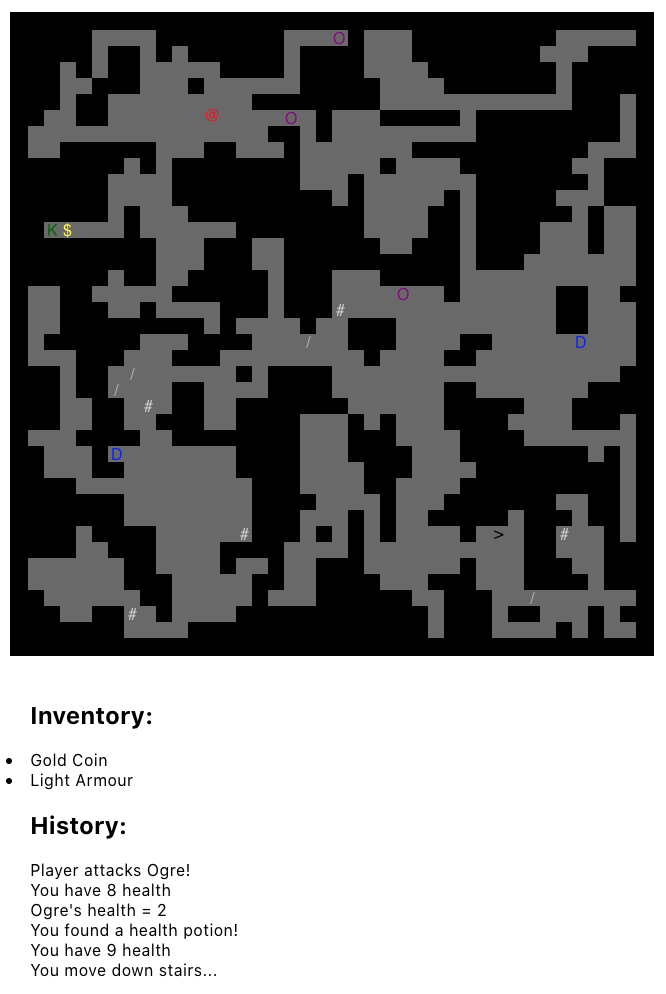

# Rogue

Roguelike game written in React with Hooks.

Uses [rot-js](https://ondras.github.io/rot.js/hp/) for map generation.

Use arrow keys to move around, collect loot and attack monsters.

```
npm install
npm start
```


